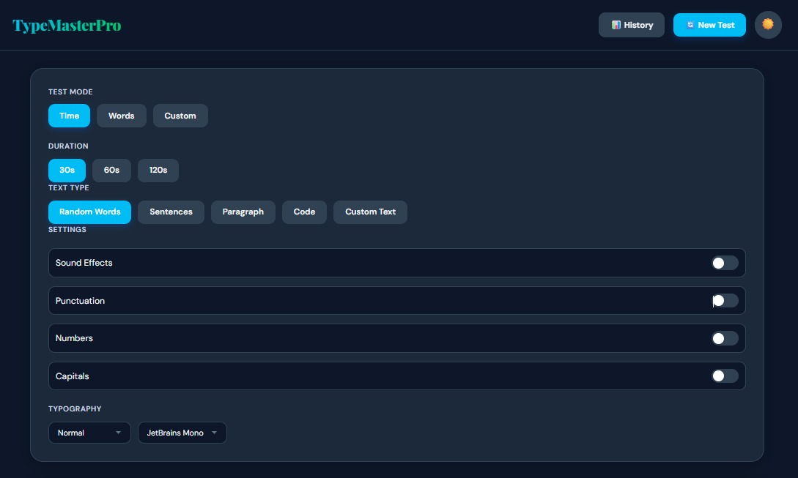
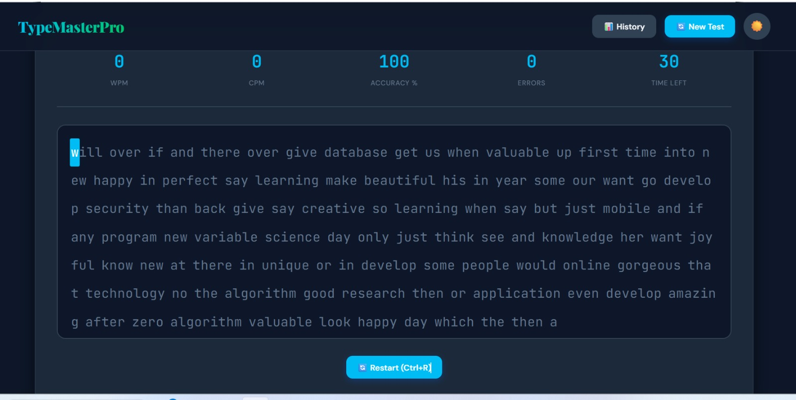
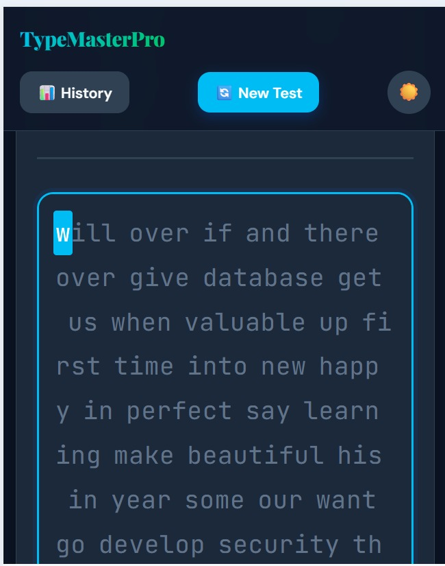

<div align="center">

# ⌨️ TypeMasterPro

### Professional Typing Speed Test Application

[](https://reactjs.org/)
[](https://vitejs.dev/)
[](https://developer.mozilla.org/en-US/docs/Web/JavaScript)
[](https://developer.mozilla.org/en-US/docs/Web/CSS)

[](LICENSE)
[](http://makeapullrequest.com)
[](https://github.com/your-username/typemasterpro/graphs/commit-activity)

!

**[Live Demo](https://typing-master-react-tau.vercel.app/)** • **[Report Bug](https://github.com/YasirAwan4831/typing-master-react)** • **[Request Feature](https://github.com/YasirAwan4831/typing-master-react)**

</div>

---

## 📖 Table of Contents

- [✨ Features](#-features)
- [🎯 Demo](#-demo)
- [🚀 Quick Start](#-quick-start)
- [🛠️ Tech Stack](#️-tech-stack)
- [📁 Project Structure](#-project-structure)
- [⚙️ Configuration](#️-configuration)
- [🎨 Customization](#-customization)
- [📊 Performance](#-performance)
- [🤝 Contributing](#-contributing)
- [📝 License](#-license)
- [👨‍💻 Author](#-author)
- [🙏 Acknowledgments](#-acknowledgments)

---

## ✨ Features

<div align="center">

| Feature | Description |
|---------|-------------|
|  **Real-time Testing** | Live WPM, CPM and accuracy tracking |
|  **Performance Analytics** | Beautiful charts showing your progress |
|  **Dark/Light Theme** | Eye-friendly themes for day and night |
|  **Responsive Design** | Works seamlessly on all devices |
|  **Multiple Test Modes** | Time-based, word-based, and custom modes |
|  **Diverse Content** | Random words, sentences, paragraphs, and code |
|  **Sound Effects** | Optional audio feedback for keystrokes |
|  **Local Storage** | Your progress is saved automatically |
|  **History Tracking** | Review your past test results |
| ⌨ **Custom Text** | Practice with your own content |
|  **Typography Options** | Multiple fonts and sizes available |
|  **Performance Levels** | From Beginner to Pro rankings |

</div>

---

##  Demo

<div align="center">

### 🖥️ Desktop View



### 📱 Mobile View



### 📊 Tablait


</div>

---

##  Quick Start

### Prerequisites


### Installation
```bash
# 1️⃣ Clone the repository
git clone https://github.com/YasirAwan4831/typing-master-react

# 2️⃣ Navigate to project directory
cd typing-master-react

# 3️⃣ Install dependencies
npm install

# 4️⃣ Start development server
npm run dev

# 5️⃣ Build for production
npm run build

# 6️⃣ Preview production build
npm run preview
```

### 🌐 Environment Variables

Create a `.env` file in the root directory:
```env
VITE_APP_NAME=TypeMasterPro
VITE_APP_VERSION=1.0.0
```

---

## 🛠️ Tech Stack

<div align="center">

### Frontend


### Build Tools


### Deployment


### Libraries & APIs

- **React Hooks** - State management
- **Context API** - Global state
- **Web Audio API** - Sound effects
- **Canvas API** - Performance charts
- **Local Storage API** - Data persistence

</div>

---

## 📁 Project Structure
```
typing-master-react/
├─ 📂 public/                    # Static assets
│  ├─ .htaccess                  # Apache configuration
│  ├─ favicon.ico                # App icon
│  ├─ index.html                 # HTML template
│  ├─ manifest.json              # PWA manifest
│  ├─ robots.txt                 # SEO crawler instructions
│  ├─ sitemap.xml                # SEO sitemap
│
├─ 📂 src/                       # Source code
│  ├─ 📂 components/             # React components
│  │  ├─ 📂 Chart/               # Performance chart
│  │  ├─ 📂 Common/              # Reusable components
│  │  │  ├─ 📂 Button/
│  │  │  ├─ 📂 Input/
│  │  │  └─ 📂 ToggleSwitch/
│  │  ├─ 📂 ControlPanel/        # Test configuration
│  │  ├─ 📂 Footer/              # App footer
│  │  ├─ 📂 History/             # Test history
│  │  ├─ 📂 Navbar/              # Navigation bar
│  │  ├─ 📂 ResultModal/         # Results display
│  │  └─ 📂 TypingArea/          # Main typing interface
│  │
│  ├─ 📂 context/                # React Context
│  │  ├─ HistoryContext.jsx      # History state
│  │  ├─ SettingsContext.jsx     # Settings state
│  │  └─ ThemeContext.jsx        # Theme state
│  │
│  ├─ 📂 data/                   # Static data
│  │  ├─ codeSnippets.js         # Code samples
│  │  ├─ paragraphs.js           # Practice paragraphs
│  │  ├─ sentences.js            # Practice sentences
│  │  └─ words.js                # Word list
│  │
│  ├─ 📂 hooks/                  # Custom React hooks
│  │  ├─ useHistory.js           # History management
│  │  ├─ useLocalStorage.js      # Storage management
│  │  ├─ useSound.js             # Sound effects
│  │  ├─ useTheme.js             # Theme management
│  │  ├─ useTimer.js             # Timer logic
│  │  └─ useTypingTest.js        # Main test logic
│  │
│  ├─ 📂 styles/                 # Global styles
│  │  ├─ animations.css          # Animations
│  │  ├─ global.css              # Global styles
│  │  └─ variables.css           # CSS variables
│  │
│  ├─ 📂 utils/                  # Utility functions
│  │  ├─ constants.js            # App constants
│  │  ├─ helpers.js              # Helper functions
│  │  ├─ soundEffects.js         # Audio utilities
│  │  └─ textGenerator.js        # Text generation
│  │
│  ├─ App.jsx                    # Main app component
│  ├─ App.module.css             # App styles
│  ├─ index.css                  # Entry styles
│  └─ main.jsx                   # Entry point
│
├─ .gitignore                    # Git ignore rules
├─ package.json                  # Dependencies
├─ package-lock.json             # Dependency lock
├─ README.md                     # Documentation
├─ LICENSE                       # MIT License
└─ vite.config.js                # Vite configuration
```

---

## ⚙️ Configuration

###  Theme Customization

Edit `src/styles/variables.css` to customize colors:

```css
:root {
  --primary: #2563eb;      /* Primary color */
  --accent: #10b981;       /* Accent color */
  --bg-primary: #f8fafc;   /* Background */
  --text-primary: #0f172a; /* Text color */
}

```

###  Performance Settings

Adjust in `src/utils/constants.js`:
```javascript
export const TIME_OPTIONS = [30, 60, 120]; // Time modes (seconds)
export const WORD_COUNT_OPTIONS = [10, 25, 50, 100]; // Word modes
export const TYPING_STATS = {
  CHARS_PER_WORD: 5,
  MAX_HISTORY_SAVED: 50
};

```

---

##  Customization

### Adding New Text Types
```
1. Add data to `src/data/` folder
2. Update `textGenerator.js`
3. Add option in `TextTypeSelector.jsx`
```
### Creating Custom Themes

```
1. Define colors in `variables.css`
2. Add theme toggle logic in `ThemeContext.jsx`
3. Update theme switcher UI
```

### Adding New Languages

```
1. Create translation files
2. Implement i18n support
3. Update text data with translations

```
---

## 📊 Performance

<div align="center">

| Metric | Score |
|--------|-------|
|  **Performance** | 98/100 |
|  **Accessibility** | 82/100 |
|  **Best Practices** | 100/100 |
|  **SEO** | 100/100 |
</div>
---

### Optimization Features

- ✅ Code splitting
- ✅ Lazy loading
- ✅ Image optimization
- ✅ Minification
- ✅ Gzip compression
- ✅ Browser caching
- ✅ PWA ready

---

## 🤝 Contributing

### How to Contribute

1. **Fork** the Project
2. **Create** your Feature Branch (`git checkout -b feature/AmazingFeature`)
3. **Commit** your Changes (`git commit -m 'Add some AmazingFeature'`)
4. **Push** to the Branch (`git push origin feature/AmazingFeature`)
5. **Open** a Pull Request

### Contribution Guidelines

- Follow the existing code style
- Write meaningful commit messages
- Add tests for new features
- Update documentation as needed
- Be respectful and constructive

<div align="center">

[](https://github.com/YasirAwan4831/typing-master-react/graphs/contributors)
[](https://github.com/YasirAwan4831/typing-master-react/network/members)
[](https://github.com/YasirAwan4831/typing-master-react/stargazers)
[](https://github.com/YasirAwan4831/typing-master-react/issues)

</div>

---

## 📝 License

This project is licensed under the **MIT License** - see the [LICENSE](LICENSE) file for details.


---

## 👨‍💻 Author

<div align="center">

### Muhammad  Yasir 

**Full Stack Developer | React Enthusiast | UI/UX Designer**

[](https://yasirawaninfo.vercel.app/)
[](https://linkedin.com/in/yasirawan4831)
[](https://github.com/YasirAwan4831)
[](https://x.com/YasirAwan4831)
[](mailto:my3154831409@gmail.com)
[](https://instagram.com/yasirawan4831)
[](https://facebook.com/profile.php?id=61575935942197)
</div>

---

## 🌟 Star History

<div align="center">

[](https://star-history.com/#your-username/typemasterpro&Date)

</div>

---

## 📈 Stats

<div align="center">


</div>

---

<div align="center">

### 💙 If you found this project helpful, please consider giving it a ⭐!

**Made with by Muhammad Yasir**

 **Web** https://yasirawaninfo.vercel.app/


</div>

---

<div align="center">

**[⬆ Back to Top](#️-typemasterpro)**

</div>


